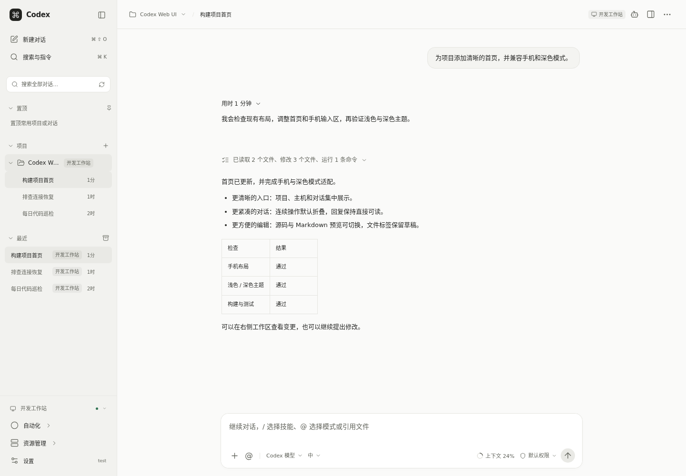
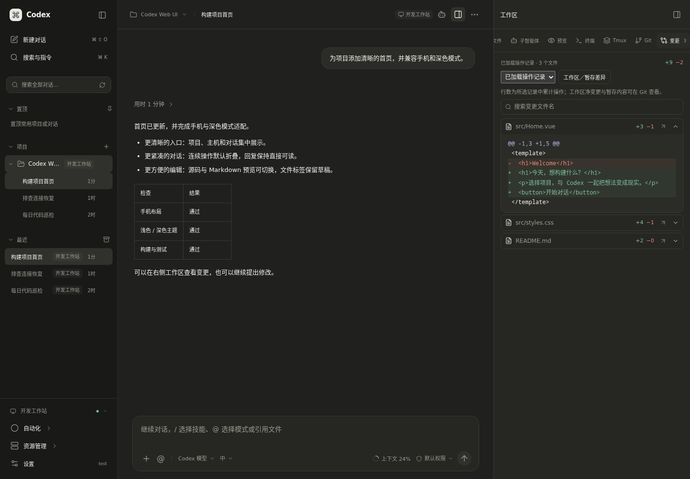
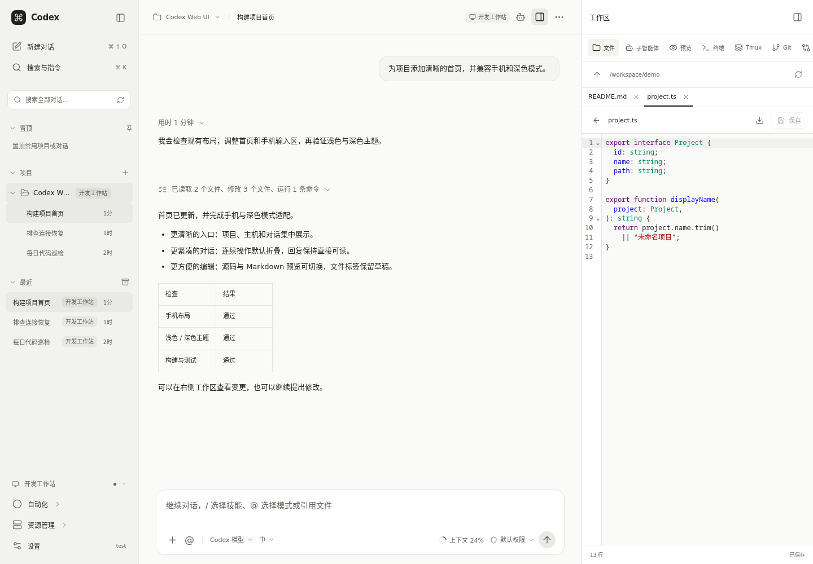
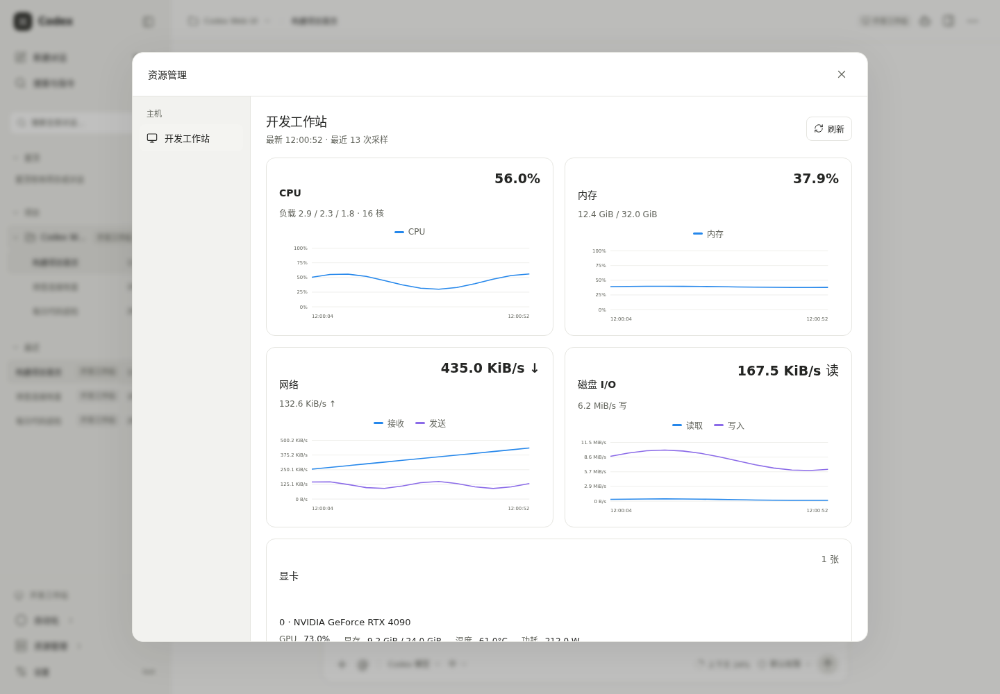
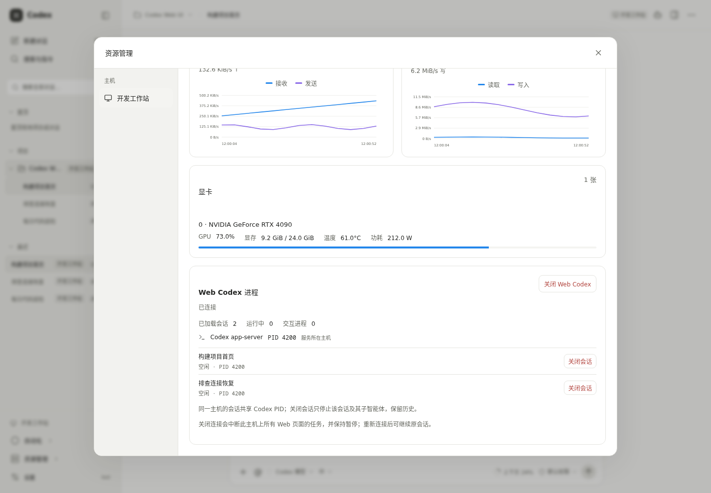
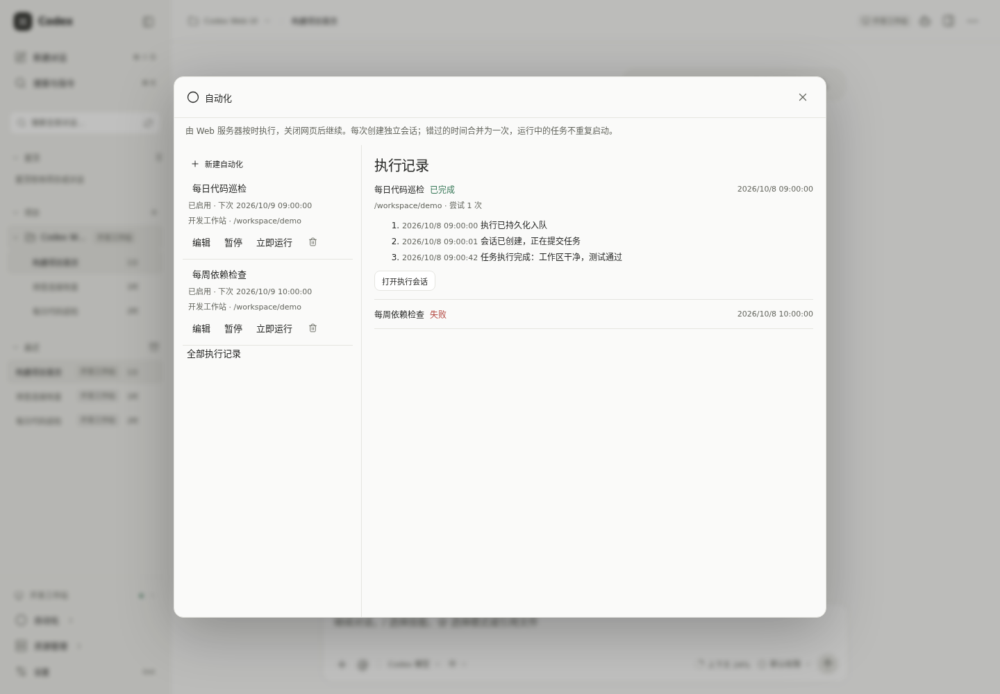
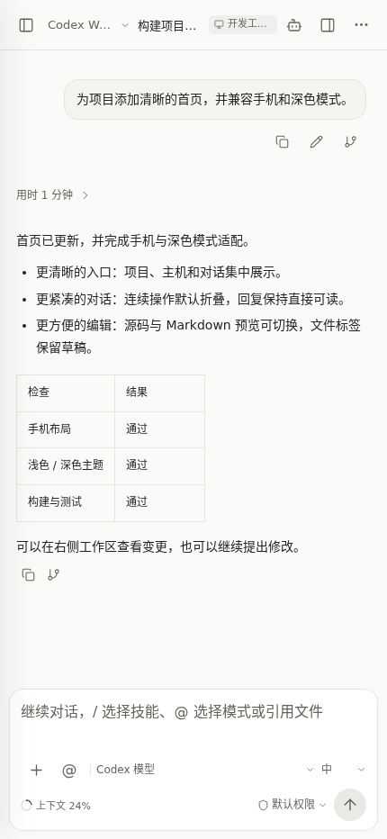

# Codex Web UI

**简体中文** · [English](README.en.md)

Vue 3 + TypeScript + Node.js 22 构建的 Codex 网页客户端，支持桌面和手机布局。对话、历史、Fork、压缩、模型、配置、审批、文件与终端使用官方 **Codex app-server** 协议；Node 服务负责浏览器鉴权与连接桥接。

这是完整桌面工作流的开发基线。当前功能与仍待完成的桌面能力列在下面，不将协议中存在的 API 等同于已完成的产品功能。[官方 app-server 文档](https://learn.chatgpt.com/docs/app-server)。

## 界面预览

下图来自真实 Vue 界面，使用固定演示数据，未包含实际主机、账户或私人对话。资源数值及执行记录用于展示界面，不代表性能基准。

<table>
  <tr>
    <td align="center"><strong>桌面对话与操作批次</strong><br></td>
    <td align="center"><strong>深色模式与文件变更</strong><br></td>
  </tr>
  <tr>
    <td align="center"><strong>多文件编辑</strong><br></td>
    <td align="center"><strong>主机资源趋势</strong><br></td>
  </tr>
  <tr>
    <td align="center"><strong>显卡与会话连接</strong><br></td>
    <td align="center"><strong>定时自动化与执行记录</strong><br></td>
  </tr>
</table>

<details>
<summary>查看手机布局</summary>

<p align="center"></p>

</details>

截图生成：`npm ci`、`npx playwright install chromium`，再执行 `npm run docs:screenshots`。脚本只启动独立前端和测试协议数据，不连接实际 Codex 或运行模型；图片不打包进 Docker 镜像。

[Docker 部署](#docker-快速部署) · [功能与限制](#功能状态) · [开发与验证](#开发与验证) · [本轮审查与改进建议](docs/project-audit.md)

## Docker 快速部署

安装 Docker Engine/Desktop 和 Docker Compose v2，在仓库目录执行：

```sh
cp deploy/docker/env.example .env.docker
chmod 600 .env.docker
mkdir -p workspace
```

编辑 `.env.docker`，填写至少 12 位的独立 `CODEX_WEB_PASSWORD`，并将 `WORKSPACE_PATH` 指向要使用的项目目录；可用 `openssl rand -hex 32` 生成密码。Linux 下，该目录须允许容器用户 `1000:1000` 读写。

```sh
docker compose --env-file .env.docker -f compose.yaml -f compose.local.yaml up -d --build
```

打开 [http://127.0.0.1:8787](http://127.0.0.1:8787)，用网页密码登录，在“设置 → 连接”添加已安装 Codex 的 SSH 主机，选择该主机和项目。纯 SSH 部署无需在容器安装 CLI。Codex 模型账户登录与网页密码分别管理。

Linux 本机执行可直接只读复用宿主已有安装。npm 安装在 `.env.docker` 设置 `HOST_CODEX_DIRECTORY` 为 `npm root -g` 下的整个 `@openai` 目录，并设置容器入口；例如：

```dotenv
HOST_CODEX_DIRECTORY=/usr/local/lib/node_modules/@openai
CODEX_BIN=/opt/host-codex/codex/bin/codex.js
```

随后对该部署的每条 Compose 命令增加 `-f compose.host-codex.yaml`：

```sh
docker compose --env-file .env.docker -f compose.yaml -f compose.local.yaml -f compose.host-codex.yaml up -d --build
docker compose --env-file .env.docker -f compose.yaml -f compose.local.yaml -f compose.host-codex.yaml exec app sh -c '"$CODEX_BIN" --version'
docker compose --env-file .env.docker -f compose.yaml -f compose.local.yaml -f compose.host-codex.yaml exec app sh -c '"$CODEX_BIN" login --device-auth'
```

登录使用容器持久化的 `CODEX_HOME`，共享安装不会自动共享宿主账户。原生 Linux 二进制、nvm 路径和账户复用见 [宿主 Codex 配置](docs/docker.md#直接使用宿主-codex)。宿主或远端升级 CLI 后，完成活动任务再重新启动对应 app-server；无需重新构建 Web 镜像。

标准 Docker 隔离策略可能阻止 Codex 的 Linux sandbox 创建 namespace；本次实测只读/工作区命令遇到该限制。需要终端、Tmux 或模型命令工具时，可由用户明确选择 Codex“完全访问”，其范围包含容器可访问的挂载及 SSH 主机。部署配置不会自动切换权限，也不使用 privileged 模式。[权限说明](docs/docker.md#检查与排错)。

镜像包含 Git、SSH、Tmux，使用非 root 用户；Codex 直接使用本机或远端已有安装，镜像不内置或固定 CLI 版本。网页数据和容器 Codex 配置/历史分别保存在持久化卷中，SSH 历史保存在远端。本地方案只发布回环端口，公网方案使用 Caddy HTTPS。Docker 中的“本机”指容器；不会自动使用 macOS/Windows 桌面账户或连接桌面 daemon。

完整公网部署、SSH、桌面同步边界、升级备份和排错见 [Docker 部署指南](docs/docker.md) / [English guide](docs/docker.en.md)。本地和公网 Compose 配置分别使用，勿同时加载两个 overlay。

## 手机安装与后台通知

使用公网 HTTPS 部署后，打开“设置 → 应用与通知”安装 PWA，并主动点击“启用通知”。Android Chrome 可使用“安装应用”或浏览器安装菜单；iOS/iPadOS 16.4+ 请在 Safari 中“分享 → 添加到主屏幕”，从主屏幕打开应用后再启用通知。

标准 Web Push 支持回复完成、需要审批/补充输入和运行出错提醒，关闭页面或锁屏后仍可接收；服务器和对应 Codex 任务必须继续运行。设备授权与网页登录会话均最长 30 天，分别管理；明确退出登录会撤销当前登录关联的设备订阅，修改访问密码会撤销其他设备的订阅。通知标题显示对话名，正文显示事件，不包含回复正文、命令或文件路径。系统强退、省电、专注模式和通知设置可能影响送达，真实 Android/iPhone 验收仍需在目标设备完成。

VAPID 密钥默认自动生成并持久化到 `DATA_DIR`，Docker 的 `webdata` 卷已经覆盖，无须手动生成。安装、更新、部署参数和手机验收步骤见 [PWA 与通知指南](docs/pwa.md) / [English guide](docs/pwa.en.md)。

## Node.js 启动

需要 Node.js 22+；本机执行使用已有的可执行 Codex CLI，纯 SSH 模式只要求远端已安装。当前运行兼容性核对版本为 `codex-cli 0.160.0`，应用不固定或自动更新 CLI。以下本机示例先以运行 Web 服务的系统账户配置 Codex：

```sh
codex --version
codex login
npm ci
cp .env.example .env
npm run dev
```

打开 [http://127.0.0.1:5173](http://127.0.0.1:5173)。后端监听 `127.0.0.1:8787`。第一次启动未设置 `CODEX_WEB_PASSWORD` 时会创建随机密码，显示在后端终端，并保存到 `.data/bootstrap-password.txt`，文件权限为 `0600`。也可以在 `.env` 设置至少 12 位的访问密码。

网页登录有效期最长 30 天；持久保存 `DATA_DIR` 时，正常服务重启保留有效登录。在“设置 → 账户 → 网页访问 → 修改访问密码”填写当前密码和两次新密码即可保存。新密码至少 12 个字符；保存后当前设备继续登录并续期，其他设备的登录及后台通知授权被撤销。访问密码散列保存到 `DATA_DIR/web-password.json`（`0600`），优先于 `.env` 和初始密码；之后修改环境变量不会覆盖已保存密码。Docker 保留 `webdata` 卷即可保留修改，忘记密码的重置方式见 [部署指南](docs/docker.md#访问密码与登录)。

网页访问密码与 Codex 模型账户分别管理。默认继承当前用户的 Codex 登录和配置；不要为了启动网页复制账户 token 到前端。

构建后由 Node 提供前端：

```sh
npm run build
npm start
```

此时访问 [http://127.0.0.1:8787](http://127.0.0.1:8787)。公网使用 HTTPS 反向代理并设置密码和 `PUBLIC_ORIGIN`，具体见 [部署文档](docs/deployment.md)、[Caddyfile](deploy/Caddyfile) 与 [systemd 示例](deploy/codex-web.service)。

## 功能状态

“已接入”表示包含真实协议调用与 UI；模型账户、SSH 和桌面实时互通的环境验证见 [验证清单](docs/validation.md)。

| 功能 | 当前实现 | 限制/说明 |
| --- | --- | --- |
| 自动/手动上下文压缩 | 显示 token 使用比例，历史用量只读补齐；压缩期间显示提醒，完成分隔线保留原位置；可设置自动触发阈值 | 原生响应仅表示开始，等待实际完成事件；Codex 自身自动压缩继续由模型/配置管理（[恢复机制](docs/runtime-stability.md)） |
| 对话引用与侧边提问 | 选择消息正文后添加引用，或在独立只读侧边聊天中提问；保留原对话草稿与运行 | 临时侧边会话不持久保存，不触发完成推送；协议支持与重连限制见[说明](docs/selection-side-chat.md) |
| 对话 Fork | 已接入 `thread/fork`，支持当前会话与已完成 turn 的分支 | 分支使用新 thread id；无法从正在执行的 turn 截止分支 |
| 编辑上一条消息 | 用户消息旁的编辑按钮、取消与保存并重新发送；使用 `thread/revert` 在原会话重新生成回复，保留图片等结构化输入 | 仅支持最近一个已结束 turn 的单条用户消息；追加指令所在的多消息轮、legacy/临时会话暂不支持；已执行命令和文件修改不会撤销 |
| 多 Web 端同步 | 同一主机的页面共享持久 app-server，实时同步消息与状态；连续连接轻量检查，事件丢失时补齐历史 | 保留各页面草稿；原生进程变化后重新确认写入资格；桌面/CLI 的独立 app-server 仍受会话写入锁约束 |
| 强制进入会话 | 写入锁冲突时显示重试与强制进入；先检查占用进程和受影响会话数量，确认后终止并恢复原对话 | Linux 本机/SSH 主机需 Python 3.9+；共享 Codex 进程中的其他会话会一同结束；Docker 无法识别宿主机进程时可改用 SSH 连接宿主机 |
| 配置与项目加载 | 按 cwd 读取配置来源/版本和受管要求，版本校验保存；加载本机桌面项目、按主机浏览选择项目及额外工作目录；新对话直接选择项目与本机/远端 | 桌面项目元数据为只读兼容适配，网页自增项目不反写桌面状态；更改新对话位置保留文字，同主机保留附件，跨主机重新上传原文件 |
| SSH 主机 | 添加/编辑弹窗、私钥上传与替换、未保存配置的连接测试；通过远端交互登录 shell 自动识别 Codex，也可指定路径 | 支持最大 64 KB 的无口令 OpenSSH / PEM 私钥；测试不保存主机、不打断聊天；可在连接弹窗获取并确认新主机指纹；指纹变化需重新确认，需准备远端 CLI 与登录 |
| 审批 | 命令/文件改动、额外权限、工具提问与基础 MCP 输入面板；同主机登录设备共享待审批请求 | 首个有效答复生效；依赖当前 Codex sandbox/审批策略，高级 MCP schema 与桌面宿主请求尚未完全覆盖 |
| 文件与变更 | 多文件标签、行号/语法高亮、选中代码引用/侧边提问、Markdown 源码/预览、图片/PDF 预览；文件名筛选、下载与红绿增删行数 | 最多 16 个标签，单文件最多 8 MB；私人草稿保留原始版本以核对保存冲突；二进制文件禁止文本编辑；[文件工作流](docs/automations-and-editor.md) |
| 终端与 Tmux | 交互式 Shell、PTY、stdin、resize、重连恢复、手机控制键；tmux 会话列表、窗格输出快照、新建、切换、确认删除 | 目标主机需安装 tmux；切换只断开 tmux 客户端，普通终端保留；macOS 沙箱拦截 socket 时需用户选择完全访问 |
| 预览 | 静态 HTML、URL、本机/SSH 开发端口代理、HTTP/WebSocket、Vite HMR、桌面/手机预览宽度 | 开发服务限 loopback，iframe 使用独立 opaque origin；真实 SSH 目标环境待验证，外部网站可能禁止 iframe |
| 公网鉴权 | 密码、持久化 30 天 Cookie 会话、设置内修改密码、CSRF、Origin 校验、登录限流 | 修改后当前设备保持登录，其他设备重新登录；持久挂载 DATA_DIR 时正常重启保留有效登录；单用户工作站，不包含多租户隔离和 SSO |
| `/`、`@`、快捷键 | Slash 指令菜单、项目文件搜索引用、页面内命令面板 | 快捷键需要网页获得焦点；不支持系统级全局唤醒 |
| 模型与权限选择 | 模型/推理强度、持久化全局只读/默认/完全访问、会话权限覆盖、命名 Web 权限预设、受管策略与提供方能力展示 | 全局修改从下一轮任务生效，受管策略仍约束权限；模型列表不保证账户具备所有模型权限 |
| 文件/图片上传 | 每次最多 8 个文件、每文件 20 MB（proxy 的 base64 消息还受 16 MiB 传输上限限制），上传到所选工作站；图片以 `localImage` 发送 | 普通文件通过路径交给 Codex；上传不等同于模型原生解析任意文件格式 |
| 会话与事件 | 新建、恢复、停止、追加指令、Fork、侧栏重命名与删除、归档恢复、全文搜索、完整导出、历史分页、草稿/阅读位置；运行时过程展开，结束后折叠，最终回复直接显示 | 永久删除需确认，会连同子智能体对话删除且无法恢复；运行中需先停止，旧版 Codex 不支持时提示升级。内容时间使用 `recencyAt`，打开对话不改变排序；连续操作按批次默认折叠，展开后查看原有明细；无公开摘要的思考条目不显示；审批与失败原因保持可见；跨桌面活动进程同步需连接同 daemon |
| 结构化选择 | 推荐选项及说明、其他回答、多题、保密输入；页面与通知提醒；支持新版异步问题 | 识别原生 `requestUserInput` 请求及 `agentMessage.delivery=async` 的题目元数据，普通正文列表不生成表单；异步回答以原生关联消息发送，跨页面同步，发送结果不确定时先同步确认；只有服务端提供时限才显示倒计时 |
| 子智能体工作区 | 当前对话的子智能体自动预读，点击直接显示缓存；实时更新未选中的内容，支持分组与历史分页 | 最多同时读取三个；子对话只读，不恢复写入者；切换主机、父对话和退出登录清理缓存 |
| 会话缓存与恢复 | 点击立即进入目标会话，跨主机也先显示缓存；首屏读取历史摘要，展开工作过程后每页加载 40 条记录，已加载详情可以复用；安装应用重进恢复上次主机、对话和草稿 | 私人快照按有效登录、主机和会话隔离，最多 12 个会话 / 4 MiB / 24 小时，退出登录清理；旧版 Codex 自动回退完整读取，导出始终读取完整历史；权限和原生写入连接确认后才允许发送；[大对话加载说明](docs/large-conversation-sync.md) |
| 资源管理 | 侧栏设置上方进入二级主机菜单，实时 CPU / 内存 / 网络 / 磁盘趋势、NVIDIA GPU 使用率与显存、会话名称及对应 Codex PID、按会话释放/恢复连接 | Linux 需 Python 3；GPU 需 nvidia-smi；容器展示可见资源，完整宿主负载使用 SSH；按会话关闭保留其他任务；关闭整个主机连接会中断全部 Web 任务；关闭状态跨服务重启保存 |
| 手机 UI / PWA | 会话抽屉、全屏工作区、统一字号/触控间距、主题切换、安装到主屏幕、用户主动更新 | Service Worker 只缓存公开界面资源；私人历史使用独立会话缓存，不支持离线发送/审批/执行 |
| 后台通知 | 用户主动启用标准 Web Push；回复完成、审批/补充输入、运行失败分类与测试通知，点击回到对应主机/对话 | 设备授权最长 30 天，明确退出撤销当前登录关联的订阅；要求服务器与任务继续运行，手机系统送达及真实设备验收见 [PWA 指南](docs/pwa.md) |
| Skills/Apps/MCP | `/` 搜索当前主机和项目的可用 Skills，选中后发送原生 Skill 输入；查看和使用已有 Apps/MCP | 不同主机的技能独立加载；插件市场不在范围内，复杂 OAuth 与桌面宿主能力另行实现 |
| Plan / Goal | `@` 选择默认、规划或目标模式；原生规划模式和持久化对话目标，支持目标暂停、继续、清除及可选 token 预算 | 依赖当前主机 Codex 的协议与功能开关；规划模式暂停目标推进，目标继续由 Codex 自身调度，权限设置仍然生效 |
| 定时自动化 | 每日、每周指定日期或间隔执行；指定主机、目录、模型、权限和时区；持久执行记录、执行前重试与结果核对 | Web 服务端调度，关闭网页后继续；同主机不重叠，漏掉的周期合并一次；原生提交结果未知时保留会话 ID，停止重复提交；[说明](docs/automations-and-editor.md) |
| 侧栏拓扑 | 本机与所有远端同页显示置顶/项目/最近；置顶项目和普通项目各默认显示 4 个，项目内对话默认显示 4 条，可展开/收起；项目菜单提供编辑、文件定位、归档和移除 | 当前选中项目/对话保留在 4 个显示项内；完整历史仍可分页加载。编辑/移除只改变 Web 元数据，不改桌面配置或删除磁盘文件；归档可恢复 |
| 工作区布局 | 桌面工作区左侧拖动调整宽度、键盘调节、双击恢复默认，宽度在当前浏览器保存 | 窗口和侧栏变化时限制宽度，保留聊天区；手机工作区使用全屏布局，终端随面板调宽自动适配 |
| Git/worktree | 分支、状态、逐行 diff、暂存/取消暂存、明确文件提交、worktree 创建/导入/切换；NAS 只读查询无需 bwrap | 写入遵循所选权限；默认沙箱不可用时明确提示，完全访问使用完整权限；提交仅包含选择文件 |

## 与桌面同步

默认 `CODEX_CONNECTION_MODE=spawn` 启动当前系统用户的 `codex app-server --listen stdio://`，继承 `CODEX_HOME`（默认 `~/.codex`）。非 ephemeral 会话由 Codex 自己持久化；同机器、同用户、同数据目录的桌面版可以加载这些历史。桌面列表可能需要刷新。

多个已登录的 Web 页面打开同一主机、同一对话时，实时同步已接受的消息、追加指令与回复，无需刷新；各页面未发送的草稿独立保留。若桌面端或 CLI 的另一个 Codex 进程已经占用该对话，网页会显示“强制进入”。点击后先展示占用进程及受影响的会话数量，确认后终止该进程并重新打开原对话；该进程中的其他会话及运行任务也会结束。服务按原生会话锁验证进程身份，不删除锁文件；占用进程变化后需重新确认。

需要共享正在运行的 thread 时，设置：

```dotenv
CODEX_CONNECTION_MODE=proxy
# 仅当使用非默认控制 socket 时填写：
# CODEX_SOCKET_PATH=/absolute/path/app-server-control.sock
```

`proxy` 调用 `codex app-server proxy`，要求对应 daemon 已运行。它不会自动启动桌面程序或寻找任意桌面私有 socket。只有两个客户端连接到同一 app-server 进程才具备加入同一活动 thread 的条件。当前开发机的默认 daemon 控制 socket未发现，原桌面活动模型 turn/审批互通仍需目标桌面环境验证；隔离真实 daemon 的双客户端事件、活动 shell turn 和 Bridge 重连已经通过。proxy 采用 WebSocket-over-pipes，未分片消息受 daemon 的 16 MiB 通告限制。

Web bridge 不提供跨机器云同步。把 Node 服务部署到另一台服务器，会使用那台服务器的历史；SSH 工作站也使用远端用户自己的配置和存储。协议版本、分页、输入与同步边界详见 [协议说明](docs/protocol.md)。

## 常用操作

- `Cmd/Ctrl + K`：页面内命令面板；`Cmd/Ctrl + Shift + O`：新会话；`Cmd/Ctrl + J`：终端。
- `Enter`：发送；`Shift + Enter`：换行；`Esc`：关闭面板。
- 输入 `/` 搜索指令和当前主机的 Skills，选中技能后显示引用标签，发送时携带 `$技能名` 和原生技能路径；输入 `@` 搜索项目文件或选择默认、Plan、Goal 模式。附件按钮上传文件/图片。
- Plan 使用 Codex 内建规划模式；Goal 把填写的目标保存到当前对话，可指定正整数 token 预算，省略预算则不设置上限。目标卡显示状态和累计用量，可暂停、继续或清除；切换模式需等待当前轮结束或先点击停止；切到 Plan 会暂停活动目标。目标与聊天权限分开管理，切换模式不会提高权限。
- Goal 由对应主机的 Codex 在对话空闲时继续，网页关闭后仍取决于服务器和 app-server 是否持续运行；规划轮、待回答问题、活动任务或预算限制会阻止继续。暂停目标会停止后续自动推进，当前执行的轮次请使用“停止”按钮中断。当前已用隔离模拟服务验证 `0.159.2` 和 `0.160.0` 的原生模式与目标协议；不支持或关闭 Goals 的主机会显示能力提示。[官方目标说明](https://developers.openai.com/cookbook/examples/codex/using_goals_in_codex)、[app-server 协议](https://learn.chatgpt.com/docs/app-server)。
- 侧栏对话 `…` 支持重命名、置顶、归档、导出和永久删除；可直接操作其他主机及已归档对话。删除会连同子智能体对话清除，需单独确认且无法恢复。区标题/项目箭头折叠；最近标题的归档按钮恢复历史。
- 超过 4 个项目或项目内对话时，点击“显示另外…”展开，点击“收起…”恢复前 4 个显示项；当前选中项保留可见。
- 工作区 `Git` 操作分支、提交与 worktree；`预览 → 开发服务` 连接本机/SSH 端口。
- 工作区打开 Markdown 默认显示排版预览，切到“源码”可编辑并保存；预览/源码切换保留未保存的修改。“预览 → 文件 / URL”也可填写 Markdown 或图片路径，项目内相对图片与链接使用当前主机文件，HTML 继续在隔离窗口预览。
- 拖动工作区左侧边界调整宽度，双击恢复默认；边界获得焦点后用左右键调节，Shift 加快，Home/End 调到最小/最大宽度。
- 项目行右键或“…”打开菜单，“在工作区文件中显示”定位所选主机的项目目录；文件行和查看页的下载按钮保存原始文件。
- 添加项目时先选择本机或远端，再点击“浏览”选择目录；地址栏可手输绝对路径并按 Enter，支持上级和额外工作目录。浏览另一台主机不会切换当前聊天。
- 新对话输入框上方选择项目和主机；切换位置期间禁止发送，草稿会保留，附件切换主机后重新上传。已有对话继续使用原主机和目录。
- 工作区 `Tmux` 查看会话与窗格快照，新建会话、切换到交互终端，或确认删除某个会话。删除会结束该会话中的进程，断开网页终端会保留会话。
- 设置中的“连接”添加或编辑远端，填写 `host`、`user@host` 或 SSH 别名，在“身份文件”中上传私钥或填写服务端路径，可先“测试连接”。新主机可在网页获取 SHA256 指纹，确认后点击“信任并测试连接”；已变更的密钥须另行勾选确认并替换。信任记录保存在 `DATA_DIR`，后续连接继续严格核验。端口留空使用已有 SSH 配置，Codex 路径留空自动识别。“项目”添加目录，“配置”读取和保存当前主机配置。
- 聊天运行时展示公开思考摘要、进展和工具记录，结束后折叠在“用时”下，可再次展开；时长未由协议提供时显示“工作过程”。运行期间手动收起不会被新进展打断，最终回复直接显示。
- “设置 → 应用与通知”安装应用、启用/关闭通知、选择通知类别并发送测试通知；有新版本时主动“更新应用”，运行中的任务结束后再更新。
- 侧栏同页显示各主机的项目与对话，全部对话下的主机状态条已移除；底部主机选择决定新对话和工作区的执行位置，项目与对话仍保留主机标签。
- “资源管理”独立选择主机查看负载和 Web Codex 进程，不切换聊天。会话列表显示名称及对应 PID；“关闭会话”仅停止该会话及子智能体，保留其他会话和历史，关闭状态同步到所有网页并跨重启保存（[释放机制](docs/session-release.md)）。“关闭 Web Codex”释放该主机全部 Web 会话及进程，保持暂停以便桌面端接管；点击“连接 Web Codex”显式恢复。proxy 模式只释放本客户端的订阅和连接，保留共享 daemon。
- 输入框权限左侧显示当前对话的上下文比例，点击可压缩；压缩中显示提醒并保留用量，完成标记留在发生位置。上下文补读、连接复用和 NAS Git 权限说明见 [恢复机制](docs/runtime-stability.md)。直接粘贴图片添加附件，普通文字保留正常粘贴行为。

## 常见问题

| 现象 | 检查方法 |
| --- | --- |
| 页面空白、无法安装或启用通知 | 公网使用 HTTPS，确认 `PUBLIC_ORIGIN` 与访问地址一致。查看浏览器控制台及 `docker compose --env-file .env.docker logs --tail=100 app`；旧 PWA 可在设置中主动更新 |
| Docker 中没有本机的目录／历史 | “本机”指容器；`WORKSPACE_PATH` 映射到 `/workspace`。选择容器路径，或添加 SSH 主机访问宿主目录；Codex 数据由实际执行账户及 `CODEX_HOME` 决定 |
| 新 SSH 主机提示不受信任 | 在连接弹窗获取指纹，核对后点击“信任并测试连接”；已有指纹变化时先检查重装或密钥变化原因，程序会单独要求确认替换 |
| 打开对话提示已有 active writer | 在桌面／CLI 释放会话，或使用 Web 的“强制进入”。强制进入前会显示占用 PID 与影响范围；共享进程中的其他任务也可能结束 |
| NAS／Docker 命令报 `bwrap` namespace 错误 | 只读 Git 查询已使用独立主机助手；原生命令的沙箱仍依赖内核。按实际需要明确选择完全访问，并检查主机受管策略；不会自动放宽权限 |
| 重进后回到欢迎页或草稿未恢复 | 保留 `DATA_DIR` 和 Docker 数据卷，检查浏览器是否清理站点数据。安装应用会尝试恢复主机、会话、草稿及阅读位置，发送前仍需确认原生连接；浏览器存储满时会提示草稿仅留在当前窗口 |

缓存、恢复、会话交接与手机后台行为的详细边界见 [可靠性与工作流](docs/reliability-and-workflows.md)、[PWA 指南](docs/pwa.md)。

## 开发与验证

```sh
npm run typecheck
npm test
npm run build
npm run test:e2e
npm run doctor
npm run doctor:daemon
npm run doctor:preview
```

首次运行浏览器测试前执行 `npx playwright install chromium`。浏览器测试使用真实 Vue 页面与测试专用 HTTP/WebSocket 协议 fixtures，不调用模型；真实协议 smoke test 使用独立临时 `CODEX_HOME`，验证握手、配置、模型列表、历史和文件读取，不发推理 turn。CLI 未安装时协议 smoke test 跳过。

`npm run doctor` 对当前配置做只读连接诊断。需要主动验证真实推理和同数据目录跨进程历史读取时，执行 `npm run doctor -- --turn`；它会创建一条小型诊断会话并在结束后归档，会使用当前模型账户额度。开发时已通过这项验证，但它不等于桌面同 daemon 的实时同步验证。

更新 CLI 后运行 `npm run protocol:generate`，检查 `shared/protocol/` 差异，再运行类型、单元和浏览器检查。

目录说明：`src/` 为 Vue UI，`server/` 为鉴权/桥接/工作站服务，`shared/protocol/` 为 CLI 生成类型，`tests/` 为验证，`docs/` 和 `deploy/` 为协议与部署说明。`DATA_DIR` 保存网页主机、项目、上传元数据以及私有推送密钥和设备订阅，对话历史保存在 Codex 中。

最新类型、单元／协议、浏览器、依赖审计与生产构建结果见 [验证清单](docs/validation.md)，代码审查与后续优先级见 [项目审查](docs/project-audit.md)。既往实际环境检查覆盖模型推理、跨进程历史、PTY、隔离 daemon、Git/worktree、Vite HMR、Tmux 与 Docker 数据卷；浏览器尺寸测试不等同于真实手机后台推送验收。早期含本机信息的截图保留在本地，上方公开截图使用独立演示数据。

本阶段工作流及环境验收边界见 [工作流完整度](docs/roadmap.md)。插件市场不在当前范围内。

可启用的 [GitHub Actions 示例](deploy/github-actions/README.md) 覆盖应用与容器集成验证；复制到 `.github/workflows/ci.yml` 即可启用。通过 gh 上传工作流需要 GitHub 登录具有 `workflow` 权限，普通源码上传不需要该附加权限。

登录持久化、通知补投、历史增量缓存及桌面工作流的使用与边界见 [可靠性与工作流](docs/reliability-and-workflows.md)。
